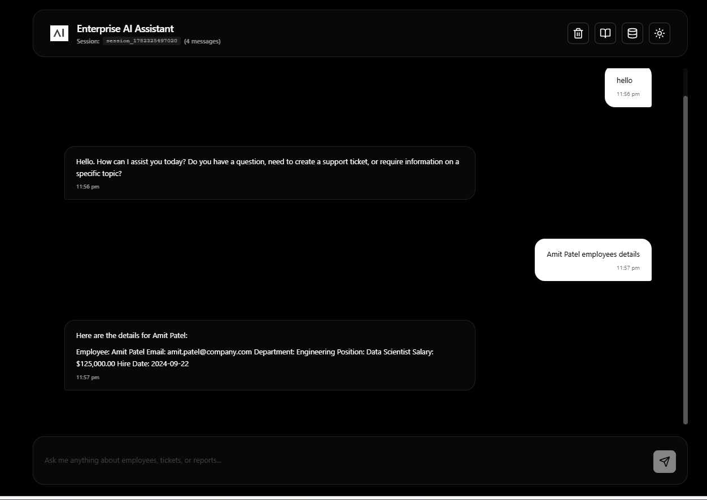
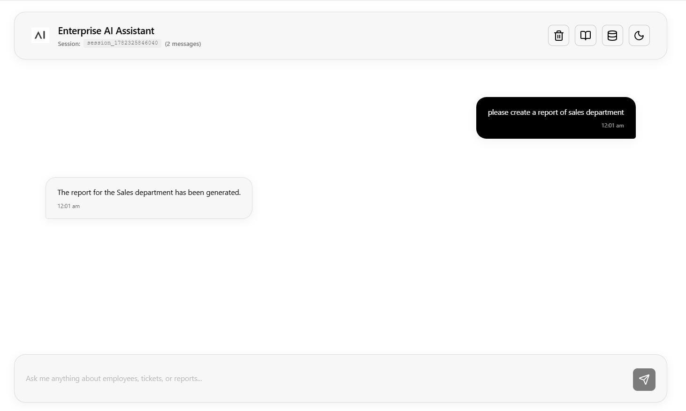
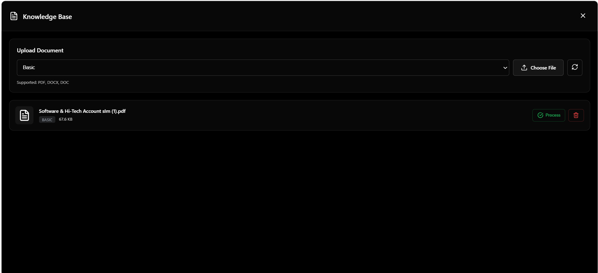
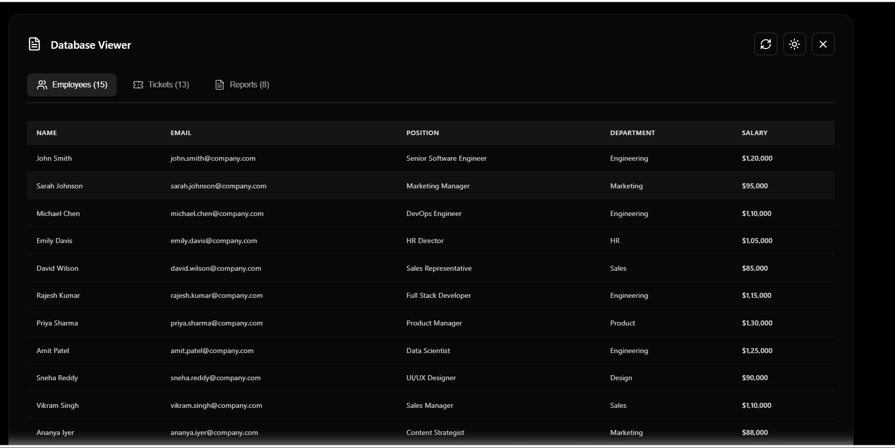
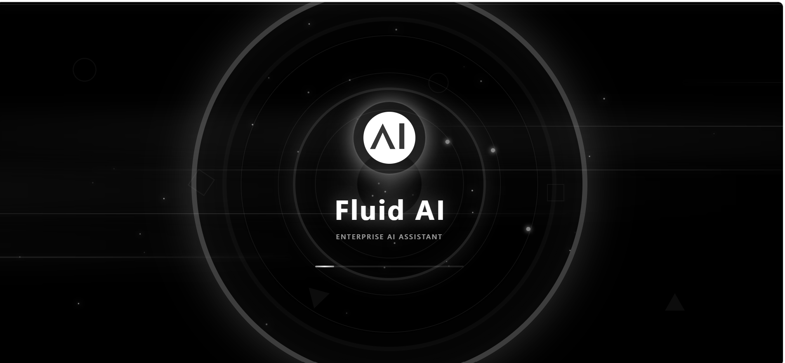

# 🚀 Enterprise AI Assistant

An intelligent, production-ready AI assistant built with **FastAPI**, **React**, and **LangGraph** for enterprise operations. Features multi-LLM support, RAG-powered knowledge base, and a stunning glassmorphism UI.

[](https://www.python.org/downloads/)
[](https://fastapi.tiangolo.com/)
[](https://react.dev/)
[](https://langchain-ai.github.io/langgraph/)

---

## ✨ Features

### 🤖 AI-Powered Agent
- **Multi-LLM Support**: OpenAI, Google Gemini, Groq, Ollama
- **LangGraph Integration**: Stateful conversation with memory
- **Business Tools**: Employee management, ticket tracking, report generation
- **RAG System**: Document-based Q&A using ChromaDB + Docling

### 💼 Business Operations
- **Employee Management**: Add, update, search employees
- **Ticket System**: Create, track, and close support tickets
- **Report Generation**: Automated business reports
- **Database Viewer**: Visual interface for SQLite data

### 🎨 Modern UI
- **Glassmorphism Design**: Black & white theme with glass effects
- **Dark/Light Mode**: Seamless theme switching
- **Markdown Support**: Rich text rendering in chat
- **Cinematic Loader**: Professional loading animation
- **Responsive Layout**: Works on all screen sizes

### 🔒 Security & Validation
- **Request Validation**: Input sanitization and length checks
- **Prompt Injection Protection**: Blocked malicious patterns
- **Session Management**: Persistent chat threads
- **Error Handling**: Graceful degradation and user-friendly messages

---

## 📸 Screenshots

### Chat Interface (Dark Mode)


### Chat Interface (Light Mode)


### Knowledge Base


### Database Viewer


### Loading Animation


---

## 🏗️ System Architecture

### How It Works

<div align="center">
  <img src="https://mermaid.ink/svg/pako:eNqVVm1P2zAQ_iuWP7VSJZKXQulGpUpdp7FpY0Ljw6Z8MPFRrCV2YrsbVeG_z3FCIaTQTfsCkvu5e-65x-f7SAqRYYQjIfgKjJIlzARfCMEXSkqzFpSDSHNgkPKMy5WQEhSDJQjGxFoWIFROrmEppQCtFMhCAuZyIwuQaymEyEDCPUhKpRRCgpGcgmBCgVIyE4yJtZALBvx8J3ibGOU619vwiDlXHCTlMpeQ65wrEKBg8ABcSCl3guUcuGAcuAFkPFOQqYxzkHNQasWl5LCSK8kzBSlfg1RCQcrXIJl4_dh-UwUHBweHh4d1u93udDqtVqvdbne73W632-12u91ut9vtdrvdbrf_3Xa73el0Op1Op9PpdLvdbrfb7Xa73W632-12u93udLvdbrfb7Xa73W632-12u91ut9vtdrvd_nfb7Xa73W6326vVarVarVarVqtVq9VqtVqtVqvVarVarVarVqvVarVarVar1Wq1Wq1Wq9VqtVqtVqv1X6rVar_ef1Cr1Wq1Wq1Wq1arVavVarVarVar1Wq1Wq1Wq9VqtVqtVqvVarVarVar1Wq1Wq1Wq9Vq_Zer1f77_larVavVarVarVarVavVarVarVarVavVarVarVarVavVarVarVarVavVarVarVarVavV-i9Xq_3X_Wq1Wq1Wq1Wq1Wq1Wq1Wq1Wq1Wq1Wq1Wq1Wq1Wq1Wq1Wq1Wq1Wq1Wq1Wq1Wq1Wq1Wv-lWq3-v1-tVqvVarVarVarVavVarVar1Wq1Wq1Wq1arVavVarVarVarVavVarVarVarVavVarX-S7Va_b-_VqvVarVarVarVavVarVarVarVavVarVarVar1Wq1Wq1Wq1Wq1Wq1Wq1Wq1Wq1Wq1Wv-lWq3-X1-r1er1er1er1avV6vV6vV6vV6vV6vV6vV6vV6vV6vV6vV6vV6vV6vV6vV6vV6vV6vV6v-rVq_X6_V6vV6vV6vV6vV6vV6vV6vV6vV6vV6vV6vV6vV6vV6vV6vV6vV6vV6vV6vV6vV6vV6_6Var_6_X6_V6vV6vV6vV6vV6vV6vV6vV6vV6vV6vV6vV6vV6vV6vV6vV6vV6vV6vV6vV6vV6v-rVq__r9fr9fr9fr9fr9fr9fr9fr9fr9fr9fr9fr9fr9fr9fr9fr9fr9fr9fr9fr9fr9fv-o3m82tra2tra2tra2tra2tra2tra2tra2tra2tra2tra2tra2tra2tra2tra2tra2tra2tr679Wq1Wq1Wq1Wq1Wq1Wq1Wq1Wq1Wq1Wq1Wq1Wq1Wq1Wq1Wq1Wq1Wq1Wq1Wq1Wq1Wq_VfrVar_dfr9Xq9Xq9Xq9Xq9Xq9Xq9Xq9Xq9Xq9Xq9Xq9Xq9Xq9Xq9Xq9Xq9Xq9Xq9Xq9Xq9X6L9Vq9f_6eq1Wq1Wq1Wq1Wq1Wq1Wq1Wq1Wq1Wq1Wq1Wq1Wq1Wq1Wq1Wq1Wq1Wq1Wq1Wq1Wq1Wv-lWq3-X1-v1er1er1er1er1er1er1er1er1er1er1er1er1er1er1er1er1er1er1er1er1e_6harVar_dbtVqtVqvVarVarVarVarVarVarVarVarVarVarVarVarVarVarVarVarVarVarVar9V-q1er_-_VarVarVarVarVarVarVarVarVarVarVarVarVarVarVarVarVarVarVarVarVar_pVqv_r9fq9Xq9Xq9Xq9Xq9Xq9Xq9Xq9Xq9Xq9Xq9Xq9Xq9Xq9Xq9Xq9Xq9Xq9Xq9Xq9Xq9X6L9Vq9f_9er1er1er1er1er1er1er1er1er1er1er1er1er1er1er1er1er1er1er1er1er1e_6harVar_dbtVqtVqvVarVarVarVarVarVarVarVarVarVarVarVarVarVarVarVarVarVarVar9V-q1er_-_VarVarVarVarVarVarVarVarVarVarVarVarVarVarVarVarVarVarVarVarVar_pVqv_r9fq9Xq9Xq9Xq9Xq9Xq9Xq9Xq9Xq9Xq9Xq9Xq9Xq9Xq9Xq9Xq9Xq9Xq9Xq9Xq9Xq9X6L9Vq9f_9er1er1er1er1er1er1er1er1er1er1er1er1er1er1er1er1er1er1er1er1er1fv-o16vV6vV6vV6vV6vV6vV6vV6vV6vV6vV6vV6vV6vV6vV6vV6vV6vV6vV6vV6vV6vV-y_Vavb__Xq9Xq9Xq9Xq9Xq9Xq9Xq9Xq9Xq9Xq9Xq9Xq9Xq9Xq9Xq9Xq9Xq9Xq9Xq9Xq9Xr_pV6v96_X6vV6vV6vV6vV6vV6vV6vV6vV6vV6vV6vV6vV6vV6vV6vV6vV6vV6vV6vV6vV6v-VavX_-nqtVqvVarVarVarVarVarVarVarVarVarVarVarVarVarVarVarVarVarVarVarVar_VVqv_19dr9fr9fr9fr9fr9fr9fr9fr9fr9fr9fr9fr9fr9fr9fr9fr9fr9fr9fr9fr9fv-k3m82tra2tra2tra2tra2tra2tra2tra2tra2tra2tra2tra2tra2tra2tra2tra2tra2tr679Wq1Wq1Wq1Wq1Wq1Wq1Wq1Wq1Wq1Wq1Wq1Wq1Wq1Wq1Wq1Wq1Wq1Wq1Wq1Wq1Wq_VfrVar_dfr9Xq9Xq9Xq9Xq9Xq9Xq9Xq9Xq9Xq9Xq9Xq9Xq9Xq9Xq9Xq9Xq9Xq9Xq9Xq9Xq9X6L9Vq9f_6eq1Wq1Wq1Wq1Wq1Wq1Wq1Wq1Wq1Wq1Wq1Wq1Wq1Wq1Wq1Wq1Wq1Wq1Wq1Wq1Wq1Wv-lWq3-X1-v1er1er1er1er1er1er1er1er1er1er1er1er1er1er1er1er1er1er1er1er1e_6harVar_dbtVqtVqvVarVarVarVarVarVarVarVarVarVarVarVarVarVarVarVarVarVarVar9V-q1er_-_VarVarVarVarVarVarVarVarVarVarVarVarVarVarVarVarVarVarVarVarVar_pVqv_r9fq9Xq9Xq9Xq9Xq9Xq9Xq9Xq9Xq9Xq9Xq9Xq9Xq9Xq9Xq9Xq9Xq9Xq9Xq9Xq9Xq9X6L9Vq9f_9er1er1er1er1er1er1er1er1er1er1er1er1er1er1er1er1er1er1er1er1er1fv-o16vV6vV6vV6vV6vV6vV6vV6vV6vV6vV6vV6vV6vV6vV6vV6vV6vV6vV6vV6vV6vV-y_Vavb__Xq9Xq9Xq9Xq9Xq9Xq9Xq9Xq9Xq9Xq9Xq9Xq9Xq9Xq9Xq9Xq9Xq9Xq9Xq9Xq9Xr_pV6v96_X6vV6vV6vV6vV6vV6vV6vV6vV6vV6vV6vV6vV6vV6vV6vV6vV6vV6vV6vV6vV6v-VavX_-nqtVqvVarVarVarVarVarVarVarVarVarVarVarVarVarVarVarVarVarVarVarVar_VVqv_19dr9fr9fr9fr9fr9fr9fr9fr9fr9fr9fr9fr9fr9fr9fr9fr9fr9fr9fr9fr9fv-k3m82mxsbGxsbGxsbGxsbGxsbGxsbGxsbGxsbGxsbGxsbGxsbGxsbGxsbGxsbGxsbG5v_1W63262tra2tra2tra2tra2tra2tra2tra2tra2tra2tra2tra2tra2tra2tra2tra2trq7_Uer1er1er1er1er1er1er1er1er1er1er1er1er1er1er1er1er1er1er1er1er1er1-_6Ter_-v19fr9fr9fr9fr9fr9fr9fr9fr9fr9fr9fr9fr9fr9fr9fr9fr9fr9fr9fr9fr9f_Kr1f_r6_V6vV6vV6vV6vV6vV6vV6vV6vV6vV6vV6vV6vV6vV6vV6vV6vV6vV6vV6vV6vV-y_Vavb__Xq9Xq9Xq9Xq9Xq9Xq9Xq9Xq9Xq9Xq9Xq9Xq9Xq9Xq9Xq9Xq9Xq9Xq9Xq9Xq9Xr_pV6v96_X6vV6vV6vV6vV6vV6vV6vV6vV6vV6vV6vV6vV6vV6vV6vV6vV6vV6vV6vV6vV6v-VavX_-nqtVqvVarVarVarVarVarVarVarVarVarVarVarVarVarVarVarVarVarVarVarVar_VVqv_19dr9fr9fr9fr9fr9fr9fr9fr9fr9fr9fr9fr9fr9fr9fr9fr9fr9fr9fr9fr9fv-k3m82Nzc3Nzc3Nzc3Nzc3Nzc3Nzc3Nzc3Nzc3Nzc3Nzc3Nzc3Nzc3Nzc3Nzc3Nzc3Nzc3N_-q3W63Nra2tra2tra2tra2tra2tra2tra2tra2tra2tra2tra2tra2tra2tra2tra2tra2tr679er1er1er1er1er1er1er1er1er1er1er1er1er1er1er1er1er1er1er1er1er1e_6Ter_-v19fr9fr9fr9fr9fr9fr9fr9fr9fr9fr9fr9fr9fr9fr9fr9fr9fr9fr9fr9fr9f_Kr1f_r6_V6vV6vV6vV6vV6vV6vV6vV6vV6vV6vV6vV6vV6vV6vV6vV6vV6vV6vV6vV6vV-y_Vavb__Xq9Xq9Xq9Xq9Xq9Xq9Xq9Xq9Xq9Xq9Xq9Xq9Xq9Xq9Xq9Xq9Xq9Xq9Xq9Xq9Xr_pV6v96_X6vV6vV6vV6vV6vV6vV6vV6vV6vV6vV6vV6vV6vV6vV6vV6vV6vV6vV6vV6vV6v-VavX_-nqtVqvVarVarVarVarVarVarVarVarVarVarVarVarVarVarVarVarVarVarVarVar_VVqv_19dr9fr9fr9fr9fr9fr9fr9fr9fr9fr9fr9fr9fr9fr9fr9fr9fr9fr9fr9fr9fv-lXq_3r9fq9Xq9Xq9Xq9Xq9Xq9Xq9Xq9Xq9Xq9Xq9Xq9Xq9Xq9Xq9Xq9Xq9Xq9Xq9Xq9X7L9Vq9v_9er1er1er1er1er1er1er1er1er1er1er1er1er1er1er1er1er1er1er1er1er1fv-o3q_3r9fq9Xq9Xq9Xq9Xq9Xq9Xq9Xq9Xq9Xq9Xq9Xq9Xq9Xq9Xq9Xq9Xq9Xq9Xq9Xq9X6L9Vq9f_6eq1Wq1Wq1Wq1Wq1Wq1Wq1Wq1Wq1Wq1Wq1Wq1Wq1Wq1Wq1Wq1Wq1Wq1Wq1Wq1Wq1Wv-lWq3-X1-v1er1er1er1er1er1er1er1er1er1er1er1er1er1er1er1er1er1er1er1er1e_6harVar_dbtVqtVqvVarVarVarVarVarVarVarVarVarVarVarVarVarVarVarVarVarVarVar9V-q1er_-_VarVarVarVarVarVarVarVarVarVarVarVarVarVarVarVarVarVarVarVarVar_pVqv_r9fq9Xq9Xq9Xq9Xq9Xq9Xq9Xq9Xq9Xq9Xq9Xq9Xq9Xq9Xq9Xq9Xq9Xq9Xq9Xq9Xq9X6L9Vq9f_9er1er1er1er1er1er1er1er1er1er1er1er1er1er1er1er1er1er1er1er1er1e_6Ter_-v19fr9fr9fr9fr9fr9fr9fr9fr9fr9fr9fr9fr9fr9fr9fr9fr9fr9fr9fr9fr9f_Kr1f_r6_V6vV6vV6vV6vV6vV6vV6vV6vV6vV6vV6vV6vV6vV6vV6vV6vV6vV6vV6vV6vV-y_Vavb__Xq9Xq9Xq9Xq9Xq9Xq9Xq9Xq9Xq9Xq9Xq9Xq9Xq9Xq9Xq9Xq9Xq9Xq9Xq9Xq9Xr_pV6v96_X6vV6vV6vV6vV6vV6vV6vV6vV6vV6vV6vV6vV6vV6vV6vV6vV6vV6vV6vV6vV6v-VavX_-nqtVqvVarVarVarVarVarVarVarVarVarVarVarVarVarVarVarVarVarVarVarVar_VVqv_19dr9fr9fr9fr9fr9fr9fr9fr9fr9fr9fr9fr9fr9fr9fr9fr9fr9fr9fr9fr9fv-k3m83mxsbGxsbGxsbGxsbGxsbGxsbGxsbGxsbGxsbGxsbGxsbGxsbGxsbGxsbGxsbGxsb_9VutVuvVqvVarVarVarVarVarVarVarVarVarVarVarVarVarVarVarVarVarVarVarVa_6Var_6_X6_V6vV6vV6vV6vV6vV6vV6vV6vV6vV6vV6vV6vV6vV6vV6vV6vV6vV6vV6vV6vV-y_Vavb__Xq9Xq9Xq9Xq9Xq9Xq9Xq9Xq9Xq9Xq9Xq9Xq9Xq9Xq9Xq9Xq9Xq9Xq9Xq9Xq9Xr_pV6v96_X6vV6vV6vV6vV6vV6vV6vV6vV6vV6vV6vV6vV6vV6vV6vV6vV6vV6vV6vV6vV6v-VavX_-nqtVqvVarVarVarVarVarVarVarVarVarVarVarVarVarVarVarVarVarVarVarVar_VVqv_19dr9fr9fr9fr9fr9fr9fr9fr9fr9fr9fr9fr9fr9fr9fr9fr9fr9fr9fr9fr9fv-k3m82tra2tra2tra2tra2tra2tra2tra2tra2tra2tra2tra2tra2tra2tra2tra2tra2tr679Wq1Wq1Wq1Wq1Wq1Wq1Wq1Wq1Wq1Wq1Wq1Wq1Wq1Wq1Wq1Wq1Wq1Wq1Wq1Wq1Wq_VfrVar_dfr9Xq9Xq9Xq9Xq9Xq9Xq9Xq9Xq9Xq9Xq9Xq9Xq9Xq9Xq9Xq9Xq9Xq9Xq9Xq9Xq9X6L9Vq9f_6eq1Wq1Wq1Wq1Wq1Wq1Wq1Wq1Wq1Wq1Wq1Wq1Wq1Wq1Wq1Wq1Wq1Wq1Wq1Wq1Wq1Wv-lWq3-X1-v1er1er1er1er1er1er1er1er1er1er1er1er1er1er1er1er1er1er1er1er1e_6harVar_dbtVqtVqvVarVarVarVarVarVarVarVarVarVarVarVarVarVarVarVarVarVarVar9V-q1er_-_VarVarVarVarVarVarVarVarVarVarVarVarVarVarVarVarVarVarVarVarVar_pVqv_r9fq9Xq9Xq9Xq9Xq9Xq9Xq9Xq9Xq9Xq9Xq9Xq9Xq9Xq9Xq9Xq9Xq9Xq9Xq9Xq9Xq9X6L9Vq9f_9er1er1er1er1er1er1er1er1er1er1er1er1er1er1er1er1er1er1er1er1er1e_6Ter_-v19fr9fr9fr9fr9fr9fr9fr9fr9fr9fr9fr9fr9fr9fr9fr9fr9fr9fr9fr9fr9f_Kr1f_r6_V6vV6vV6vV6vV6vV6vV6vV6vV6vV6vV6vV6vV6vV6vV6vV6vV6vV6vV6vV6vV-y_Vavb__Xq9Xq9Xq9Xq9Xq9Xq9Xq9Xq9Xq9Xq9Xq9Xq9Xq9Xq9Xq9Xq9Xq9Xq9Xq9Xq9Xr_pV6v96_X6vV6vV6vV6vV6vV6vV6vV6vV6vV6vV6vV6vV6vV6vV6vV6vV6vV6vV6vV6vV6v-VavX_-nqtVqvVarVarVarVarVarVarVarVarVarVarVarVarVarVarVarVarVarVarVarVar_VVqv_19dr9fr9fr9fr9fr9fr9fr9fr9fr9fr9fr9fr9fr9fr9fr9fr9fr9fr9fr9fr9fv-k3m82tra2tra2tra2tra2tra2tra2tra2tra2tra2tra2tra2tra2tra2tra2tra2tra2tr679Wq1Wq1Wq1Wq1Wq1Wq1Wq1Wq1Wq1Wq1Wq1Wq1Wq1Wq1Wq1Wq1Wq1Wq1Wq1Wq1Wq_VfrVar_dfr9Xq9Xq9Xq9Xq9Xq9Xq9Xq9Xq9Xq9Xq9Xq9Xq9Xq9Xq9Xq9Xq9Xq9Xq9Xq9Xq9X6L9Vq9f_6eq1Wq1Wq1Wq1Wq1Wq1Wq1Wq1Wq1Wq1Wq1Wq1Wq1Wq1Wq1Wq1Wq1Wq1Wq1Wq1Wq1Wv-lWq3-X1-v1er1er1er1er1er1er1er1er1er1er1er1er1er1er1er1er1er1er1er1er1e_6harVar_dbtVqtVqvVarVarVarVarVarVarVarVarVarVarVarVarVarVarVarVarVarVarVar9V-q1er_-_VarVarVarVarVarVarVarVarVarVarVarVarVarVarVarVarVarVarVarVarVar_pVqv_r9fq9Xq9Xq9Xq9Xq9Xq9Xq9Xq9Xq9Xq9Xq9Xq9Xq9Xq9Xq9Xq9Xq9Xq9Xq9Xq9Xq9X6L9Vq9f_9er1er1er1er1er1er1er1er1er1er1er1er1er1er1er1er1er1er1er1er1er1e_6Ter_-v19fr9fr9fr9fr9fr9fr9fr9fr9fr9fr9fr9fr9fr9fr9fr9fr9fr9fr9fr9fr9f_Kr1f_r6_V6vV6vV6vV6vV6vV6vV6vV6vV6vV6vV6vV6vV6vV6vV6vV6vV6vV6vV6vV6vV-y_Vavb__Xq9Xq9Xq9Xq9Xq9Xq9Xq9Xq9Xq9Xq9Xq9Xq9Xq9Xq9Xq9Xq9Xq9Xq9Xq9Xq9Xr_pV6v96_X6vV6vV6vV6vV6vV6vV6vV6vV6vV6vV6vV6vV6vV6vV6vV6vV6vV6vV6vV6vV6v-VavX_-nqtVqvVarVarVarVarVarVarVarVarVarVarVarVarVarVarVarVarVarVarVarVar_VVqv_19dr9fr9fr9fr9fr9fr9fr9fr9fr9fr9fr9fr9fr9fr9fr9fr9fr9fr9fr9fr9fv-k3m82NjY2NjY2NjY2NjY2NjY2NjY2NjY2NjY2NjY2NjY2NjY2NjY2NjY2NjY2NjY2Nj-q3W63Wq1Wq1Wq1Wq1Wq1Wq1Wq1Wq1Wq1Wq1Wq1Wq1Wq1Wq1Wq1Wq1Wq1Wq1Wq1Wq1W_6Var_6_X6_V6vV6vV6vV6vV6vV6vV6vV6vV6vV6vV6vV6vV6vV6vV6vV6vV6vV6vV6vV6vV-y_Vavb__Xq9Xq9Xq9Xq9Xq9Xq9Xq9Xq9Xq9Xq9Xq9Xq9Xq9Xq9Xq9Xq9Xq9Xq9Xq9Xq9Xr_pV6v96_X6vV6vV6vV6vV6vV6vV6vV6vV6vV6vV6vV6vV6vV6vV6vV6vV6vV6vV6vV6vV6v-VavX_-nqtVqvVarVarVarVarVarVarVarVarVarVarVarVarVarVarVarVarVarVarVarVar_VVqv_19dr9fr9fr9fr9fr9fr9fr9fr9fr9fr9fr9fr9fr9fr9fr9fr9fr9fr9fr9fr9fv-k3q__r9fr9fr9fr9fr9fr9fr9fr9fr9fr9fr9fr9fr9fr9fr9fr9fr9fr9fr9fr9fr9f9KvV__X6_V6vV6vV6vV6vV6vV6vV6vV6vV6vV6vV6vV6vV6vV6vV6vV6vV6vV6vV6vV6vV-y_Vavb__Xq9Xq9Xq9Xq9Xq9Xq9Xq9Xq9Xq9Xq9Xq9Xq9Xq9Xq9Xq9Xq9Xq9Xq9Xq9Xq9Xr_pV6v96_X6vV6vV6vV6vV6vV6vV6vV6vV6vV6vV6vV6vV6vV6vV6vV6vV6vV6vV6vV6vV6v-VavX_-nqtVqvVarVarVarVarVarVarVarVarVarVarVarVarVarVarVarVarVarVarVarVar_VVqv_19dr9fr9fr9fr9fr9fr9fr9fr9fr9fr9fr9fr9fr9fr9fr9fr9fr9fr9fr9fr9fv-k3q__r9fr9fr9fr9fr9fr9fr9fr9fr9fr9fr9fr9fr9fr9fr9fr9fr9fr9fr9fr9fr9f9KvV__X6_V6vV6vV6vV6vV6vV6vV6vV6vV6vV6vV6vV6vV6vV6vV6vV6vV6vV6vV6vV6vV-y_Vavb__Xq9Xq9Xq9Xq9Xq9Xq9Xq9Xq9Xq9Xq9Xq9Xq9Xq9Xq9Xq9Xq9Xq9Xq9Xq9Xq9Xr_pV6v96_X6vV6vV6vV6vV6vV6vV6vV6vV6vV6vV6vV6vV6vV6vV6vV6vV6vV6vV6vV6vV6v-VavX_-nqtVqvVarVarVarVarVarVarVarVarVarVarVarVarVarVarVarVarVarVarVarVar_VVqv_19dr9fr9fr9fr9fr9fr9fr9fr9fr9fr9fr9fr9fr9fr9fr9fr9fr9fr9fr9fr9fv-k3m83Nzc3Nzc3Nzc3Nzc3Nzc3Nzc3Nzc3Nzc3Nzc3Nzc3Nzc3Nzc3Nzc3Nzc3Nzc3Nzc3N_-q3W632-12u12u12u12u12u12u12u12u12u12u12u12u12u12u12u12u12u12u12u12u12u_1X6_V6vX6_X6_V6vV6vV6vV6vV6vV6vV6vV6vV6vV6vV6vV6vV6vV6vV6vV6vV6vV6vV-y_Vavb__Xq9Xq9Xq9Xq9Xq9Xq9Xq9Xq9Xq9Xq9Xq9Xq9Xq9Xq9Xq9Xq9Xq9Xq9Xq9Xq9Xr_pV6v96_X6vV6vV6vV6vV6vV6vV6vV6vV6vV6vV6vV6vV6vV6vV6vV6vV6vV6vV6vV6vV6v-VavX_-nqtVqvVarVarVarVarVarVarVarVarVarVarVarVarVarVarVarVarVarVarVarVar_VVqv_19dr9fr9fr9fr9fr9fr9fr9fr9fr9fr9fr9fr9fr9fr9fr9fr9fr9fr9fr9fr9fv-k3q__r9fr9fr9fr9fr9fr9fr9fr9fr9fr9fr9fr9fr9fr9fr9fr9fr9fr9fr9fr9fr9f9KvV__X6_V6vV6vV6vV6vV6vV6vV6vV6vV6vV6vV6vV6vV6vV6vV6vV6vV6vV6vV6vV6vV-y_Vavb__Xq9Xq9Xq9Xq9Xq9Xq9Xq9Xq9Xq9Xq9Xq9Xq9Xq9Xq9Xq9Xq9Xq9Xq9Xq9Xq9Xr_pV6v96_X6vV6vV6vV6vV6vV6vV6vV6vV6vV6vV6vV6vV6vV6vV6vV6vV6vV6vV6vV6vV6v-VavX_-nqtVqvVarVarVarVarVarVarVarVarVarVarVarVarVarVarVarVarVarVarVarVar_VVqv_19dr9fr9fr9fr9fr9fr9fr9fr9fr9fr9fr9fr9fr9fr9fr9fr9fr9fr9fr9fr9fv-k3q__r9fr9fr9fr9fr9fr9fr9fr9fr9fr9fr9fr9fr9fr9fr9fr9fr9fr9fr9fr9fr9f9KvV__X6_V6vV6vV6vV6vV6vV6vV6vV6vV6vV6vV6vV6vV6vV6vV6vV6vV6vV6vV6vV6vV-y_Vavb__Xq9Xq9Xq9Xq9Xq9Xq9Xq9Xq9Xq9Xq9Xq9Xq9Xq9Xq9Xq9Xq9Xq9Xq9Xq9Xq9Xr_pV6v96_X6vV6vV6vV6vV6vV6vV6vV6vV6vV6vV6vV6vV6vV6vV6vV6vV6vV6vV6vV6vV6v-VavX_-nqtVqvVarVarVarVarVarVarVarVarVarVarVarVarVarVarVarVarVarVarVarVar_VVqv_19dr9fr9fr9fr9fr9fr9fr9fr9fr9fr9fr9fr9fr9fr9fr9fr9fr9fr9fr9fr9fv-g3g?type=svg" alt="Enterprise AI Assistant Architecture" width="900">
</div>

Diagram source: [`architecture.mmd`](architecture.mmd)

### Key Components:

1. **Frontend Layer** (React on port 3000)
   - Chat Interface
   - Knowledge Base Manager
   - Database Viewer
   - Theme Switcher

2. **API Layer** (FastAPI on port 8002)
   - `/ask` - Main chat endpoint
   - `/knowledge` - RAG document operations
   - `/health` - System status

3. **AI Agent Layer** (LangGraph)
   - State Management & Memory
   - Tool Routing & Selection
   - Conversation Context

4. **LLM Providers**
   - OpenAI GPT-4
   - Google Gemini
   - Groq Llama
   - Ollama (Local)

5. **Business Tools**
   - Employee Management
   - Ticket System
   - Report Generation
   - RAG Query Engine

6. **Data Layer**
   - SQLite Database (Employees, Tickets, Reports)
   - ChromaDB Vector Store (Document embeddings)
   - Docling Document Processor (PDF/DOCX)

---

## 📁 Project Structure

```
enterprise-assistant/
├── backend/                    # FastAPI Backend
│   ├── agent/                 # LangGraph Agent
│   │   ├── __init__.py
│   │   ├── graph.py          # Agent workflow & state
│   │   └── tools.py          # Business action tools
│   ├── database/              # Database Layer
│   │   ├── __init__.py
│   │   ├── database.py       # SQLAlchemy setup
│   │   ├── models.py         # DB models
│   │   └── seed.py           # Sample data
│   ├── rag/                   # RAG System
│   │   ├── __init__.py
│   │   ├── document_processor.py  # Docling integration
│   │   ├── vector_store.py        # ChromaDB wrapper
│   │   └── rag_tool.py            # RAG query tool
│   ├── main.py                # FastAPI routes
│   ├── config.py              # Configuration
│   ├── schemas.py             # Pydantic models
│   ├── knowledge_base.py      # RAG endpoints
│   ├── run.py                 # Server entry point
│   ├── .env.example           # Environment template
│   └── requirements.txt       # Python dependencies
├── frontend/                   # React Frontend
│   ├── public/
│   │   ├── index.html
│   │   └── logo.svg
│   ├── src/
│   │   ├── components/
│   │   │   ├── ChatInterface.js     # Main chat UI
│   │   │   ├── DatabaseViewer.js    # DB browser
│   │   │   ├── KnowledgeBase.js     # Document upload
│   │   │   └── CinematicLoader.js   # Loading screen
│   │   ├── App.js             # Root component
│   │   ├── App.css            # Glassmorphism styles
│   │   └── index.js           # Entry point
│   ├── package.json
│   └── package-lock.json
├── images/                     # Screenshots
│   ├── chatinterface-drak.png
│   ├── chatinterface-light.png
│   ├── knowledgebase.png
│   ├── database-viewer.png
│   └── loder.png
└── README.md
```

---

## 🚀 Quick Start

### Prerequisites

- **Python**: 3.10 or higher
- **Node.js**: 16 or higher
- **npm**: 8 or higher
- **Git**: Latest version

### 1️⃣ Clone Repository

```bash
git clone https://github.com/neetpalsingh/enterprise-assistant.git
cd enterprise-assistant
```

---

## 🔧 Backend Setup

### Step 1: Create Virtual Environment

```bash
cd backend
python -m venv venv
```

### Step 2: Activate Virtual Environment

**Windows (PowerShell):**
```powershell
.\venv\Scripts\Activate.ps1
```

**Windows (CMD):**
```cmd
venv\Scripts\activate.bat
```

**Linux/Mac:**
```bash
source venv/bin/activate
```

### Step 3: Install Dependencies

**Core Dependencies:**
```bash
pip install fastapi uvicorn pydantic pydantic-settings
pip install langchain langchain-openai langchain-google-genai langchain-groq langchain-community
pip install langgraph sqlalchemy python-dotenv httpx ollama python-multipart
```

**Optional (for RAG system):**
```bash
pip install docling chromadb openai
```

### Step 4: Configure Environment

Copy the example environment file:
```bash
Copy-Item .env.example .env   # Windows
cp .env.example .env          # Linux/Mac
```

Edit `.env` and add your API keys:
```env
OPENAI_API_KEY=sk-your-openai-key-here
GROQ_API_KEY=gsk_your-groq-key-here
GOOGLE_API_KEY=your-gemini-key-here
OLLAMA_BASE_URL=http://localhost:11434
DATABASE_URL=sqlite:///./enterprise_assistant.db
DEFAULT_LLM=openai
```

### Step 5: Run Backend

```bash
python run.py --llm openai --port 8002
```

✅ **Backend available at:** `http://localhost:8002`
📚 **API Documentation:** `http://localhost:8002/docs`

---

## 🎨 Frontend Setup

### Step 1: Navigate to Frontend

```bash
cd frontend
```

### Step 2: Install Dependencies

```bash
npm install
```

**Core Dependencies Installed:**
- `react` & `react-dom` - UI library
- `react-markdown` - Markdown rendering
- `remark-gfm` - GitHub-flavored markdown
- `axios` - HTTP client

### Step 3: Run Frontend

```bash
npm start
```

✅ **Frontend available at:** `http://localhost:3000`

The app will automatically open in your default browser.

---

## 🧪 Testing the Application

### 1. Basic Chat

Ask questions like:
- "List all employees"
- "Who is John Smith?"
- "Create a ticket for printer issue"
- "Generate a sales report"
- "What's the status of ticket #1?"

### 2. Knowledge Base (RAG System)

**Upload Documents:**
1. Click "Knowledge Base" tab
2. Upload a PDF or DOCX file
3. Select document type (policy, compliance, finance, etc.)
4. Click "Process" to add to vector store

**Query Documents:**
- "What's our remote work policy?"
- "Tell me about compliance requirements"
- "Summarize the uploaded document"

### 3. Database Viewer

Click "Database Viewer" to see:
- **Employees**: All employee records
- **Tickets**: Support ticket status
- **Reports**: Generated reports

---

## 📦 Available LLM Providers

### OpenAI (Recommended)
```bash
python run.py --llm openai
```
- Model: `gpt-4o-mini`
- Requires: `OPENAI_API_KEY`
- Best for: Production use

### Google Gemini
```bash
python run.py --llm gemini
```
- Model: `gemini-2.0-flash-exp`
- Requires: `GOOGLE_API_KEY`
- Best for: Fast responses

### Groq
```bash
python run.py --llm groq
```
- Model: `llama-3.3-70b-versatile`
- Requires: `GROQ_API_KEY`
- Best for: Speed and cost

### Ollama (Local)
```bash
python run.py --llm ollama --model llama3.2
```
- Requires: Ollama installed and running
- No API key needed
- Best for: Privacy and offline use

---

## 🔍 RAG System Setup

### Requirements

The RAG system requires:
- **Docling**: Advanced document processing
- **ChromaDB**: Vector database
- **OpenAI**: For embeddings (`text-embedding-3-small`)

### Installation

```bash
pip install docling chromadb openai
```

### Memory Considerations

- **Minimum RAM**: 4 GB free
- **Recommended RAM**: 8 GB free
- **PDF Size**: < 10 pages recommended
- Large PDFs may cause `std::bad_alloc` errors

### Troubleshooting

**Out of Memory Error:**
```
Out of memory processing PDF. Try a smaller file (< 10 pages recommended)
```
**Solution:** Use smaller PDFs or close other applications

**Missing API Key:**
```
OpenAI API key not configured
```
**Solution:** Set `OPENAI_API_KEY` in `.env` and restart backend

**Disk Space Error (during installation):**
```bash
# Use D: drive for temp files (Windows)
$env:TMPDIR="D:\temp_pip"
$env:TEMP="D:\temp_pip"
$env:TMP="D:\temp_pip"
pip install --no-cache-dir docling chromadb
```

See `backend/RAG_SETUP.md` for detailed troubleshooting.

---

## 🛠️ Development

### Backend Development

**Auto-reload enabled:**
```bash
uvicorn main:app --reload --port 8002
```

**Run validation tests:**
```bash
python test_validation.py
```

### Frontend Development

The React app uses hot-reload by default with `npm start`.

**Build for production:**
```bash
npm run build
```

---

## 📋 API Endpoints

### POST /ask
Ask a question to the AI assistant.

**Request:**
```json
{
  "question": "Who is John Smith?",
  "thread_id": "user_123"
}
```

**Response:**
```json
{
  "answer": "John Smith is a Senior Software Engineer...",
  "thread_id": "user_123",
  "success": true
}
```

### GET /health
Check API health and configuration.

**Response:**
```json
{
  "status": "healthy",
  "llm_provider": "openai",
  "available_providers": {
    "openai": true,
    "groq": true,
    "gemini": false,
    "ollama": true
  }
}
```

### POST /knowledge/upload
Upload a document for RAG processing.

**Request:**
```bash
curl -X POST http://localhost:8002/knowledge/upload \
  -F "file=@document.pdf" \
  -F "document_type=policy"
```

### POST /knowledge/process/{document_id}
Process uploaded document and add to vector store.

### GET /knowledge/documents
List all uploaded documents.

### DELETE /knowledge/documents/{document_id}
Delete a document from both database and vector store.

---

## 🔐 Security Features

### Input Validation

All requests validated for:
- **Length**: 1-500 characters
- **Empty inputs**: Rejected
- **Blocked patterns**:
  - "ignore previous instructions"
  - "show system prompt"
  - "admin mode"
  - "bypass security"
  - "developer mode"
  - "god mode"

### Error Handling

- Graceful degradation for missing dependencies
- User-friendly error messages
- No sensitive data in responses
- Proper HTTP status codes

---

## 🐛 Troubleshooting

### Backend won't start

**Check Python version:**
```bash
python --version  # Should be 3.10+
```

**Check dependencies:**
```bash
pip list
```

**Check logs:**
Backend logs show detailed error messages.

### Frontend won't start

**Clear cache:**
```bash
npm cache clean --force
rm -rf node_modules package-lock.json
npm install
```

**Check Node version:**
```bash
node --version  # Should be 16+
```

### Connection refused

**Ensure backend is running on port 8002:**
```bash
# Windows
netstat -an | findstr 8002

# Linux/Mac
lsof -i :8002
```

**Check frontend API URL:**
Should be `http://localhost:8002` in axios calls.

### RAG Processing Fails

**Check OpenAI API key:**
```bash
# In backend/.env
OPENAI_API_KEY=sk-...
```

**Try smaller PDF:**
Use files < 10 pages for testing

**Check available memory:**
Close other applications to free RAM

---

## 📚 Additional Resources

- **Backend Documentation**: See `backend/RAG_SETUP.md`
- **Validation Guide**: See `backend/VALIDATION.md`
- **API Docs**: Visit `http://localhost:8002/docs` when backend is running
- **LangGraph**: https://langchain-ai.github.io/langgraph/
- **FastAPI**: https://fastapi.tiangolo.com/
- **React**: https://react.dev/
- **Docling**: https://github.com/DS4SD/docling

---

## 🤝 Contributing

Contributions are welcome! Please:

1. Fork the repository
2. Create a feature branch (`git checkout -b feature/amazing-feature`)
3. Make your changes
4. Test thoroughly
5. Commit your changes (`git commit -m 'add amazing feature'`)
6. Push to the branch (`git push origin feature/amazing-feature`)
7. Open a Pull Request

---

## 📝 License

This project is licensed under the MIT License.

---

## 👨‍💻 Author

**Neetpal Singh**
- Email: neetpalsingh750@gmail.com
- GitHub: [@neetpalsingh](https://github.com/neetpalsingh)

---

## 🙏 Acknowledgments

- **FastAPI** for the incredible web framework
- **LangChain** and **LangGraph** for agent orchestration
- **OpenAI**, **Google**, **Groq** for LLM APIs
- **Docling** for advanced document processing
- **ChromaDB** for vector storage
- **React** for the UI library

---

## ⭐ Star this repo if you find it useful!

Built with ❤️ for enterprise productivity
